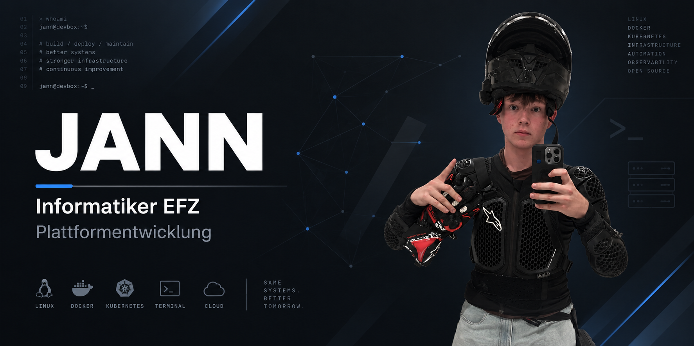

<!-- Banner -->

  Github-banner2.png" />

# JANN

**Informatiker EFZ**  
**Plattformentwicklung**

---

## 🛠️ Technologien

![Windows](https://img.shields.io/badge/Windows_Server-0078D6the-badge&logo=windows
![Linux](https://img.shields.io/badge/Linux-FCC624r-the-badge&logo=linux
![PowerShell](https://img.shields.io/badge/PowerShell-5391FE-badge&logo=powershell
![Zabbix](https://img.shields.io/badge/Zabbix-D40000-the-badge
![Docker](https://img.shadge/Docker-2496ED?style=for-the-badge&logo=docker
![Git](https://img.shields.io/badge/Git-F05032?style=for-thelogo=git

---

## 📊 GitHub Stats

![](https://github-readme-stats.vercel.app/api?username=Jann08&show_icons=true&theme=github_dark&_border=true

---

## 🔥 Streak

![](https://streak-stats.demolab.comr=Jann08&theme=github-dark-blue&hide_border=true

---

## 📈 Most Used Languages

![](https://github-readme-stvercel.app/api/top-langs/?username=Jann08&layout=compact&theme=github_dark&hide_border=true

---

## 🐍 Contributions

![snake](https://raw.githubusercontent.com/Platutput/github-contribution-grid-snake.svg

---

## 📉 Activity Graph
 
[![Activity Graph](https://github-readme-activity-graph.vercel.app/graph?username=Jdark]

---

## 🏆 Achievements
 
![](https://github-profile-trophy.vercel.app/?username=Jann08&theme=darkhub&no-e=true&row=1
